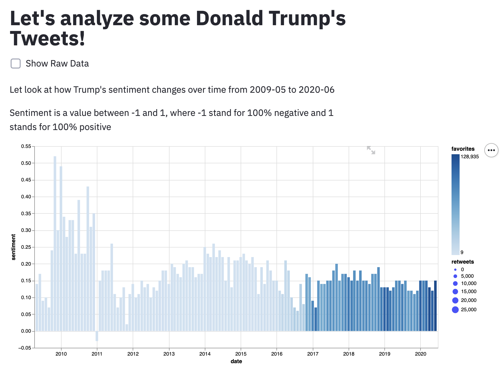
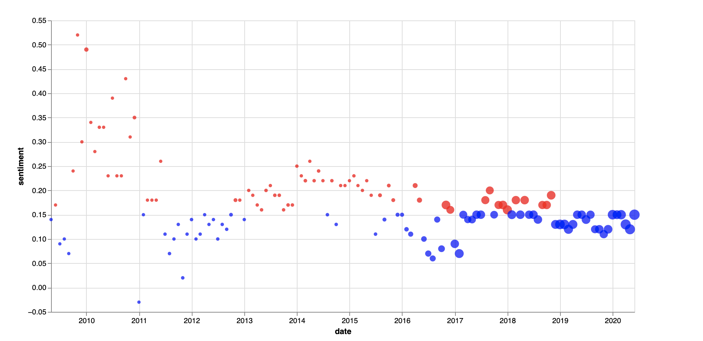

# Project name

This project uses data set about Trump’s tweets from 2009 to 2020 (https://www.kaggle.com/austinreese/trump-tweets?select=realdonaldtrump.csv).

## Project Goals
through which we hope to reveal some pattern between Trump’s twitter habit, sentiments and supports overtime. We hope users can see the pattern of him twitter tactics and its effects through the diagram.

## Design
We started with analyzing the twitter sentiments using machine learning and NLP(nltk and TextBolb), and we performed aggregration (mean) to get average retweets and favorites counts for the content over one-month timeframe. For our final visualization, we decided to use the timeline as the basic frame to understand the data since understanding the effects of the key events is important to understand how Trump’s twitter’s evolvement. What we discovered is that there is a general positive sentiments in his twitter, and its popularity (favorites and retweet) drastically increases since his announcement for candidacy (June 2015). We also observed that before winning NRA endorsement (May 2016) and before winning presidential election (Nov 2016) the sentiments generally decreased until it peaked again when he win. From the content of his Twitter we can see that while he is in the campaign competing he would make relatively negative commentary about the current situations which leads to negative sentiments.

## Development
In general, we split up the task by Jiecheng spending the most time deploying machine learning sentiment analysis (which took up the most time) and I working on data visualization. We spent an overall of around 5 hours completing the data cleaning and visualization. At the beginning of the process, we spent some time analyzing the timeline for Trump’s major events and browsed through some tweets he sent during these key events, and then we pinned down some key dates that might signal the change in his Twitter’s sentiment. By doing so at the beginning for the development, it helps us briefly validate the scope of our research.
